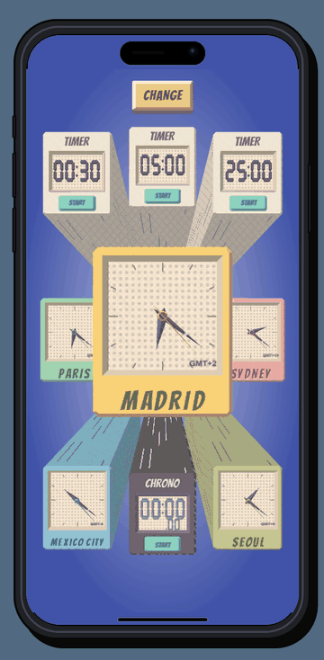
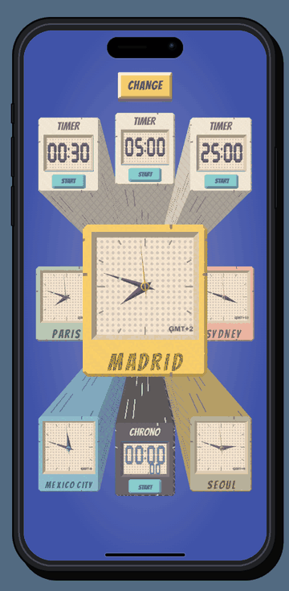

# PAPER WORLD

PAPER WORLD is a mobile world clock, timer, and stopwatch prototype rendered as a continuous three-dimensional paper world. Nine time blocks recede toward a shared vanishing point, while cel shading, ink textures, recessed lettering, beveled faces, and physical controls give the interface its tactile graphic character.

On desktop and tablet, the app appears inside a reusable iPhone canvas with zoom controls. On phones, the interface fills the screen directly.

**[Open the interactive demo](https://r3neer.github.io/paper-world/)**

## Demos

### Spatial clocks and editing



### Timers and chrono



## Run locally

```powershell
npm install
npm run dev
```

Open `http://127.0.0.1:5186/`. To verify the production bundle:

```powershell
npm run build:pages
```

The deployable site is written to `dist/`.

## Regenerate the GIFs

With the local server running on port `5186`, run:

```powershell
npm run capture:demos
```

The Playwright script records both flows in Microsoft Edge and writes the optimized GIFs to `public/demos/`. Intermediate PNG frames are stored under `artifacts/demo-frames/` and excluded from the repository.

## Interaction

- Tap any secondary block to make it the protagonist. The blocks retract, solve the spatial route without crossing, and return at their final positions.
- CHANGE makes the nine blocks sway from their distant anchor points. Select a slot to replace it with a clock, timer, or chrono.
- Double-click or double-tap a block to replace it directly and return to the main scene outside CHANGE mode.
- The clock and timer catalogs form complete spatial matrices. Drag in any direction, use the wheel or arrow keys, or search by city, country, or duration. Movement always settles on a specific block.
- Timer presets follow a spatial duration order and include sub-minute values. CUSTOM TIMER uses a protected `MM:SS` editor that normalizes overflow and preserves the separator.
- Timer and chrono controls remain usable in all nine positions. Their buttons physically sink on press, retract into the block when hidden, and emerge at their new positions.

## Visual system

The scene uses a custom Three.js `ShaderMaterial` with discrete cel-shading bands. Ink hatching appears in deep shadow, variable longitudinal strokes describe the receding prism walls, and Ben-Day dots remain on the light clock faces. Faces, hands, digital segments, hubs, labels, and controls are modeled with actual depth and bevels rather than flat decorative shadows.

Color also communicates distance: vivid blocks sit closer to the viewer, while softer paper colors recede. Timers use near-white materials; the chrono uses a dark violet body, light ink strokes, and a lighter recessed title. Every city uses an IANA time zone through `Intl.DateTimeFormat`, including seasonal offset changes.

## Structure

- `src/main.js`: Three.js scene, clock geometry, shader policy, spatial navigation, interactions, animation, and persistence.
- `src/instruments.js`: beveled digital segments, timers, chrono, and physical controls.
- `device-canvas.js` and `device-canvas.css`: reusable responsive iPhone presentation.
- `scripts/capture-demos.cjs`: reproducible Playwright demo flows.
- `scripts/build-gifs.py`: shared-palette GIF packaging.
- `scripts/build-pages.cjs`: deterministic GitHub Pages bundle.
- `DESIGN.md`: design contract and interaction rationale.

## Scope

The selected blocks, custom durations, and main position are stored in `localStorage`. Active timers and chronos do not survive a browser reload. The project has no backend, alarm, notification, sound, or telemetry service.

## References and licenses

- [Sony Pictures Imageworks: the visual language of Spider-Verse](https://www.imageworks.com/node/1371) informed the rendering policy for graphic hatching, dots, and illustrated light. No film assets are included.
- [Bangers by Vernon Adams](https://github.com/googlefonts/bangers), licensed under the SIL Open Font License. See `assets/Bangers-OFL.txt`.
- Three.js, MIT License. See `assets/Three-LICENSE.txt`.
- OpenType.js, MIT License. See `assets/OpenType-LICENSE.txt`.
